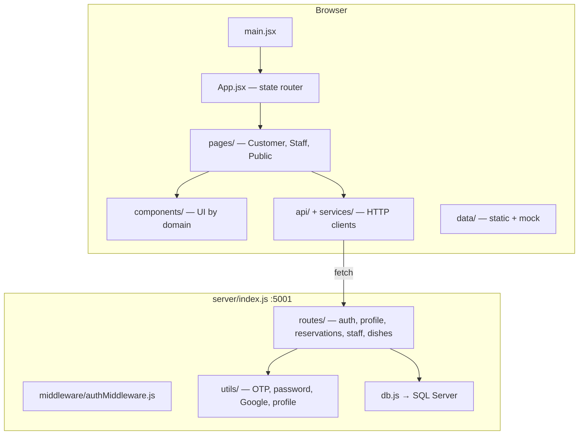

# Architecture

**Pattern:** Monolithic single-package app — Vite SPA frontend + Express REST API, co-located in `phurai-ui/`.

## High-Level Structure

Production: if `dist/` exists, Express serves static files and SPA fallback for non-`/api` routes (`server/index.js`).

## Identified Patterns

### State-based client routing (no React Router)

**Location:** `src/App.jsx`

**Purpose:** Map URL pathname → `activePage` string; render one page component at a time.

**Implementation:**
- `getPageFromPath(path)` normalizes pathname and returns page keys (`home`, `staff`, `menus`, …)
- `navigateToPath` / `handleNavigate` update state and call `history.pushState`
- `popstate` listener syncs back/forward navigation
- `/login` is special-cased: opens `AuthModal` and rewrites URL to `/`

**Example routes handled:**

| Path | Page key |
|------|----------|
| `/` | `home` |
| `/menus` | `menus` |
| `/reservations` | `reservations` |
| `/staff`, `/staff/*` | `staff` |
| `/profile` | `profile` |
| `/settings/*` | `settings` |
| Unmapped paths | `notFound` |

**Not mapped today:** `/manager`, `/admin` → fall through to `notFound` (though `NotFound.jsx` has copy for `/manager` paths).

### Portal layout split

**Location:** `src/App.jsx` (`isPortalPage`, `isStaffPage`, `isAccountPage`)

**Purpose:** Customer marketing site shows `Navbar` + `Footer` + `FloatingActionButtons`; account (`/profile`, `/settings`) and staff (`/staff`) portals hide them.

### API client layering

**Location:**
- `src/api/httpClient.js` — base `request()`, auth storage, headers
- `src/api/authApi.js`, `src/api/profileApi.js` — domain endpoints
- `src/api/index.js` — barrel export
- `src/services/reservationApi.js`, `src/services/staffApi.js` — feature-specific clients

**Pattern:** All use `fetch` against `API_BASE_URL` + path. Errors normalized via `createApiError`.

### Staff API with mock fallback

**Location:** `src/services/staffApi.js` + `src/data/staffDashboardMockData.js`

**Purpose:** Dashboard reads `/api/staff/*`; on failure or non-success response, returns mock data after ~220ms delay with `{ source: "api" | "mock", data }`.

### Role-based UI inside Staff portal (Manager vs Staff)

**Location:**
- `src/pages/staff/StaffDashboard.jsx` — `resolveRole()` maps `roleName` → `"manager"` | `"staff"` | `null`
- `src/data/staffNav.js` — `managerOnly` nav items
- Section components (`OverviewSection`, `TablesSection`, `DishesSection`, …) branch on `role === "manager"`

**Important:** Manager and Staff share the **same URL** `/staff`. There is no separate `/manager` route in `App.jsx` yet.

### Server route mounting

**Location:** `server/index.js`

| Mount | Router file |
|-------|-------------|
| `/api`, `/api/auth` | `routes/auth.js` |
| `/api/profile` | `routes/profile.js` |
| `/api/reservations` | `routes/reservations.js` |
| `/api/staff` | `routes/staff.js` |
| `/api/dishes` | `routes/dishes.js` |

Auth routes are duplicated at `/api/login` and `/api/auth/*` because router is mounted twice.

## Data Flow

### Authentication (email/password)

1. User submits credentials in `AuthModal` → `AuthCard` / `LoginForm`
2. `loginAccount()` → `POST /api/login` (`authApi.js` → `server/routes/auth.js`)
3. Backend validates against `dbo.UserAccounts`, checks `email_verified`, `is_active`
4. Frontend receives user object → `mapApiUserToFrontend()` (`userMapper.js`)
5. `saveAuthUser(user, remember)` → `localStorage` or `sessionStorage` key `phurai_auth_user`
6. On app load, `loadAuthUser()` hydrates state; optional `getProfile(uid)` refresh

### OTP / email verification

1. Register → `POST /api/register` → OTP via `otpService` + `sendOtpEmail`
2. Verify → `POST /api/auth/verify-otp`
3. Dev shortcut: sample emails log OTP to console (`server/utils/otpDev.js`)

### Google sign-in

1. Frontend loads GIS script (`googleAuth.js`), uses `VITE_GOOGLE_CLIENT_ID`
2. `POST /api/auth/google` or `/api/auth/google-register`
3. Backend verifies token (`server/utils/googleAuth.js`)

### Profile read/update

1. `useUserProfile` calls `getProfileMe` / `updateProfile`
2. Requests include `profileRequestHeaders(userId)` → `Authorization: Bearer <token>` (if stored) + `X-User-Id`
3. Server `resolveUserId` + `requireUserId` on protected routes (`server/middleware/authMiddleware.js`)

### Customer reservation

1. `ReservationPage` uses `reservationApi.js`
2. `GET /api/reservations/settings`, `/availability`, `POST /api/reservations` with user id header
3. Backend transactional logic in `server/routes/reservations.js` (SQL Server)

### Staff dashboard data

1. `StaffDashboard` on mount calls multiple `fetch*` from `staffApi.js`
2. `GET /api/staff/overview`, `/reservations/today`, `/tables/status`, `/dishes`, etc.
3. Falls back to `staffDashboardMockData.js` when API unavailable

## Code Organization

**Approach:** Feature-oriented folders under `src/` (customer pages, staff components, reservation, auth, menu).

**Frontend boundaries:**
- `pages/` — route-level screens
- `components/` — reusable UI grouped by domain (`auth`, `staff`, `reservation`, `menu`, `layout`, …)
- `api/` + `services/` — HTTP boundary
- `data/` — static config and mock datasets
- `utils/` — pure helpers
- `hooks/` — shared React hooks
- `context/` — React context providers

**Backend boundaries:**
- `routes/` — Express routers per domain
- `utils/` — business helpers (OTP, passwords, profile serialization, membership)
- `middleware/` — request identity resolution
- `database/` — SQL schema file

## Portals (product view)

| Portal | Entry URL | Main component | Access control |
|--------|-----------|----------------|----------------|
| Customer (public) | `/`, `/menus`, `/reservations`, … | Various `pages/customer/*` | Optional auth for profile/reservations |
| Customer account | `/profile`, `/settings/*` | `Profile.jsx`, `Settings.jsx` | Requires login for full features |
| Staff / Manager | `/staff` | `StaffDashboard.jsx` | `resolveRole()` — manager/admin vs restaurant/kitchen staff |
| Admin (planned) | `/admin` (not in App router) | `AdminDashboard.jsx` stub only | Not wired |
| Manager route (planned) | `/manager` (not in App router) | Uses staff dashboard target in NotFound copy | Not wired |
