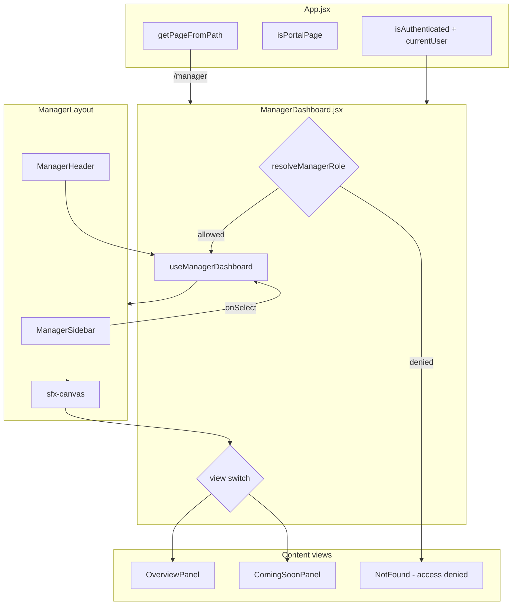
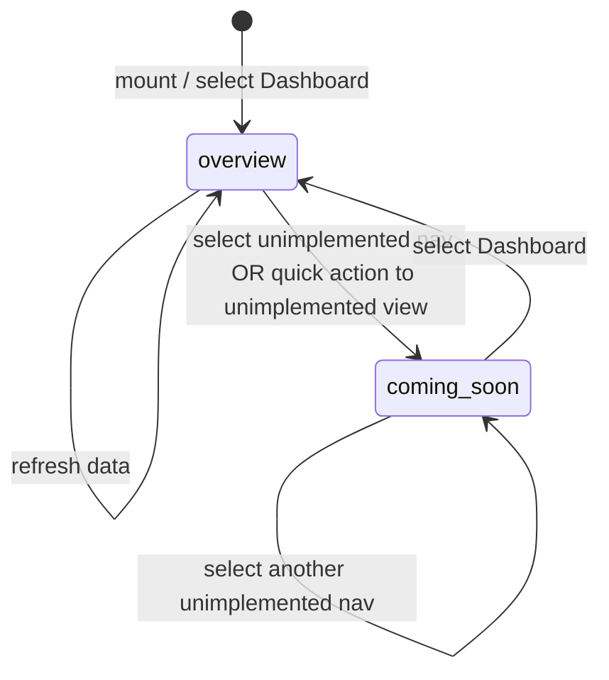
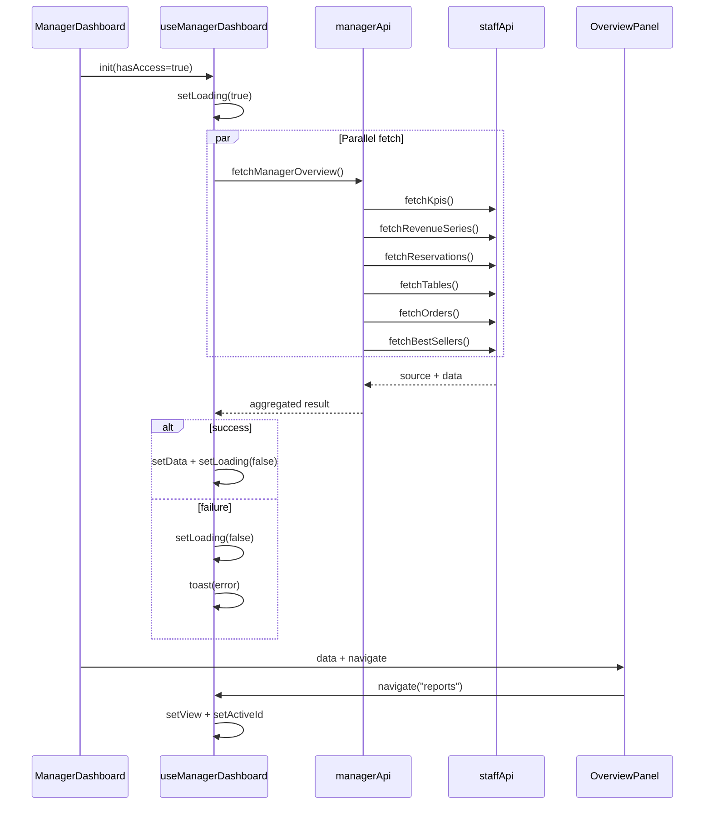

# Manager Dashboard Design

**Spec**: `.specs/features/manager-dashboard/spec.md`  
**Status**: Draft

---

## Architecture Overview

Phase 1 introduces a **second internal portal** at `/manager` that mirrors the staff portal shell pattern but owns its own feature folder (`src/features/manager-dashboard/`). Routing stays in `App.jsx` (no React Router). All manager UI state lives in **`useManagerDashboard`** (local React state). Data enters through **`managerApi.js`**, which wraps existing **`staffApi.js`** endpoints without backend changes.

Three layers:

1. **App shell** — pathname → `activePage`, portal chrome (hide Navbar/Footer), auth props passthrough.
2. **Page + hook** — `ManagerDashboard` access guard, view switch, delegates state to hook.
3. **Feature modules** — layout shell, overview panels, Coming soon placeholder.



---

## View Switch (Internal Routing)

Manager portal does **not** change the browser URL when switching sidebar items (same pattern as `StaffDashboard`). Internal state drives the main canvas:

| State field | Type | Purpose |
| ----------- | ---- | ------- |
| `view` | `string` | Active section key (`overview`, `reports`, …) |
| `activeId` | `string` | Sidebar item id (for highlight) |
| `pendingAction` | `string \| null` | One-shot intent for future sections (phase 1: consumed by quick actions navigating to unimplemented views) |

### View resolution algorithm

```text
function renderContent({ view, loading, navItem, data, actions }):
  if loading AND view === "overview":
    return LoadingPanel

  item = findNavItem(view) OR findByActiveId(activeId)
  if item AND item.implemented === false:
    return ComingSoonPanel(title=item.label, view=item.view)

  switch view:
    case "overview":
      return OverviewPanel(data, onNavigate=actions.navigate)
    default:
      return ComingSoonPanel(fallback)
```

Quick actions call `navigate(targetView, action?)`. If `targetView` maps to a nav item with `implemented: false`, the view switch sets `view` and Coming soon renders (MGR-036).



### Title / subtitle derivation

Mirror `StaffDashboard`:

- `title` = label of nav item matching `activeId` (fallback `"Dashboard"`)
- `subtitle` = `VIEW_SUBTITLE[view]` from `managerNav.js` (same keys as staff where applicable)

---

## Data Flow (`useManagerDashboard`)

The hook is the **single owner** of manager portal state. `ManagerDashboard` remains a thin coordinator (guard + layout + switch).



### Hook public contract

```javascript
/**
 * @param {{ hasAccess: boolean }} options
 * @returns {{
 *   activeId: string,
 *   view: string,
 *   pendingAction: string | null,
 *   loading: boolean,
 *   data: ManagerOverviewData,
 *   toasts: Toast[],
 *   title: string,
 *   subtitle: string,
 *   search: string,
 *   setSearch: (v: string) => void,
 *   onSelect: (item: NavItem) => void,
 *   navigate: (view: string, action?: string | null) => void,
 * }}
 */
function useManagerDashboard({ hasAccess }) { ... }
```

### Internal state shape

```javascript
// ManagerOverviewData
{
  kpis: KpiCard[],
  revenue: RevenueSeries,
  reservations: Reservation[],
  tables: Table[],
  orders: Order[],
  bestSellers: BestSeller[],
}

// Toast
{ id: number, message: string, tone: "info" | "error" | "success" }
```

### Fetch lifecycle

| Event | Behavior |
| ----- | -------- |
| `hasAccess` becomes `true` | Run `fetchManagerOverview()` once (mount) |
| `hasAccess` false | Skip fetch; page shows NotFound before hook matters |
| API partial failure | `Promise.all` catch → toast; keep loading false (mock may still resolve per staffApi) |
| Re-fetch | Not in phase 1 (no refresh button); future phase can add |

### Navigation helpers

```javascript
const FLAT_NAV = NAV_GROUPS.flatMap((g) => g.items);

function navigate(nextView, action = null) {
  const navItem =
    FLAT_NAV.find((it) => it.view === nextView && it.action === action) ||
    FLAT_NAV.find((it) => it.view === nextView && !it.action) ||
    FLAT_NAV.find((it) => it.view === nextView);
  setView(nextView);
  if (navItem) setActiveId(navItem.id);
  setPendingAction(action);
}

function onSelect(item) {
  setActiveId(item.id);
  setView(item.view);
  setPendingAction(item.action ?? null);
}
```

`pendingAction` cleared after 120ms (same as staff) for forward compatibility.

---

## Access Control Design

### Role resolution (shared logic)

Extract to `src/features/manager-dashboard/utils/managerRole.js` (or inline in page if prefer minimal files):

```javascript
export function resolveManagerRole(roleName) {
  const r = String(roleName || "").toLowerCase();
  if (r === "manager" || r === "admin") return "manager";
  return null;
}

export function resolveStaffRole(roleName) {
  const r = String(roleName || "").toLowerCase();
  if (r === "restaurant staff" || r === "kitchen staff" || r === "staff") return "staff";
  return null;
}
```

| Portal | Allowed roles | Denied UX |
| ------ | ------------- | --------- |
| `/manager` | Manager, Admin | NotFound variants (guest / customer / staff) |
| `/staff` | Restaurant Staff, Kitchen Staff | NotFound; **Manager/Admin → redirect `/manager`** |

Redirect implementation (App or StaffDashboard entry):

```javascript
useEffect(() => {
  if (!isAuthenticated || !currentUser) return;
  if (resolveManagerRole(currentUser.roleName) && pathname.startsWith("/staff")) {
    navigateToPath("/manager");
  }
}, [isAuthenticated, currentUser, pathname]);
```

Prefer guard in **`App.jsx`** before rendering `StaffDashboard` to avoid flash of staff UI (MGR-011).

---

## Code Reuse Analysis

### Existing components to leverage

| Component | Location | How to use |
| --------- | -------- | ---------- |
| `KpiCard` | `src/components/staff/KpiCard.jsx` | Import in `KpiGrid` |
| `RevenueChart` | `src/components/staff/RevenueChart.jsx` | Import in `RevenueChartPanel` |
| `Card`, `Button`, `StatusBadge` | `src/components/staff/StaffUI.jsx` | All overview panels |
| `Icon` | `src/components/staff/StaffIcons.jsx` | Sidebar, layout toasts |
| Status meta constants | `src/data/staffDashboardMockData.js` | Timeline, tables, orders |
| `formatVND` | `src/utils/formatCurrency.js` | Best sellers, orders |
| Staff API | `src/services/staffApi.js` | Wrapped by `managerApi.js` |
| Portal CSS | `src/styles/staff-dashboard.css` | Import in `ManagerDashboard.jsx` |
| `StaffLayout` pattern | `src/components/staff/StaffLayout.jsx` | Copy structure to `ManagerLayout` (local collapse/mobile state) |
| `NotFound` | `src/pages/NotFound.jsx` | Access denied + update CTA paths |

### Do not modify in phase 1 (Strangler)

| Path | Reason |
| ---- | ------ |
| `components/staff/sections/OverviewSection.jsx` | Keep until manager overview verified |
| `components/staff/StaffSidebar.jsx` | Staff portal unchanged |
| Customer Navbar/Footer/Auth | Out of scope |

### CONCERNS.md mitigations

| Concern | Design mitigation |
| ------- | ----------------- |
| Frontend-only auth (CONCERNS #3) | Same as staff — document as UX guard; no false sense of security |
| No `/manager` in router (CONCERNS #4) | Addressed in App.jsx tasks |
| App.jsx complexity (#7) | Minimal diff: one page key, one render branch, extend `isPortalPage` |

---

## Components

### `ManagerDashboard.jsx`

- **Purpose**: Route entry — access guard, hook wiring, view switch, layout wrapper.
- **Location**: `src/pages/manager/ManagerDashboard.jsx`
- **Props** (from App, mirror StaffDashboard):

```javascript
{
  isAuthenticated: boolean,
  currentUser: object | null,
  onSignOut: () => void,
  onNavigateHome: () => void,
  onNavigate: (page: string) => void,
  onOpenAuth: () => void,
}
```

- **Dependencies**: `useManagerDashboard`, `ManagerLayout`, `OverviewPanel`, `ComingSoonPanel`, `NotFound`, `staff-dashboard.css`
- **Reuses**: Guard pattern from `StaffDashboard.jsx`

---

### `ManagerLayout.jsx`

- **Purpose**: Shell with sidebar, header, main canvas, toast stack; owns `collapsed` / `mobileOpen` local UI state.
- **Location**: `src/features/manager-dashboard/layout/ManagerLayout.jsx`
- **Props**:

```javascript
{
  user, activeId, onSelect, title, subtitle,
  search, onSearch, onSignOut, toasts,
  onQuickAction?,  // optional: header quick action → navigate reservations
  children,
}
```

- **Reuses**: Structure from `StaffLayout.jsx` (no `role` prop — manager-only portal)

---

### `ManagerSidebar.jsx`

- **Purpose**: Render `NAV_GROUPS` from `managerNav.js`; brand **Manager Portal**.
- **Location**: `src/features/manager-dashboard/layout/ManagerSidebar.jsx`
- **Props**: `activeId`, `onSelect`, `collapsed`, `mobileOpen`, `onCloseMobile`, `onSignOut`
- **Reuses**: Markup/classes from `StaffSidebar.jsx`; **no** `managerOnly` filter (all items visible)

---

### `ManagerHeader.jsx`

- **Purpose**: Page title, subtitle, search input, mobile menu, collapse toggle.
- **Location**: `src/features/manager-dashboard/layout/ManagerHeader.jsx`
- **Reuses**: `StaffHeader.jsx` (role badge can show Manager/Admin from `user.roleName`)

---

### `ComingSoonPanel.jsx`

- **Purpose**: Placeholder for nav items with `implemented: false`.
- **Location**: `src/features/manager-dashboard/layout/ComingSoonPanel.jsx`
- **Props**: `{ title: string, description?: string }`
- **UI**: `Card` + short copy; reuse `sfx-stack` spacing

---

### `managerNav.js`

- **Purpose**: Nav config + subtitles + `implemented` flags.
- **Location**: `src/features/manager-dashboard/config/managerNav.js`
- **Exports**:

```javascript
export const NAV_GROUPS = [ ... ];
export const VIEW_SUBTITLE = { ... };
export const FLAT_NAV = NAV_GROUPS.flatMap((g) => g.items);
export function findNavItem({ view, activeId, action }) { ... }
export function isViewImplemented(view) { ... }
```

- **NavItem shape**:

```javascript
{
  id: string,
  label: string,
  view: string,
  icon: string,
  action?: string,
  implemented: boolean,
}
```

---

### `useManagerDashboard.js`

- **Purpose**: Central state, fetch, navigation, toasts, derived title/subtitle.
- **Location**: `src/features/manager-dashboard/hooks/useManagerDashboard.js`
- **Dependencies**: `managerApi`, `managerNav` (FLAT_NAV, VIEW_SUBTITLE)

---

### `managerApi.js`

- **Purpose**: Manager data access layer; delegates to `staffApi`.
- **Location**: `src/services/managerApi.js`
- **Exports**:

```javascript
export async function fetchManagerOverview() {
  const [kpis, revenue, reservations, tables, orders, bestSellers] =
    await Promise.all([
      fetchKpis(),
      fetchRevenueSeries(),
      fetchReservations(),
      fetchTables(),
      fetchOrders(),
      fetchBestSellers(),
    ]);
  return { kpis, revenue, reservations, tables, orders, bestSellers };
}

// Re-export granular getters if panels need them later
export { fetchKpis, ... } from "./staffApi.js";
```

---

### Overview sub-panels

| Component | Props (summary) | Notes |
| --------- | --------------- | ----- |
| `OverviewPanel.jsx` | `data`, `onNavigate` | Composes grid; no role prop (always manager view) |
| `KpiGrid.jsx` | `kpis` | All cards including revenue |
| `RevenueChartPanel.jsx` | `revenue` | Always visible |
| `QuickActionsBar.jsx` | `onNavigate` | 5 actions from spec |
| `FloorSnapshotPanel.jsx` | `reservations`, `tables`, `orders`, `onNavigate` | Timeline + table board + orders table |
| `BestSellersPanel.jsx` | `bestSellers`, `onNavigate` | Rank list |

Panel JSX ported from `OverviewSection.jsx` with manager-only conditionals removed.

---

## App.jsx Integration (Minimal Diff)

```javascript
// getPageFromPath
if (normalized === "/manager" || normalized.startsWith("/manager/")) return "manager";

// isPortalPage
const isManagerPage = pathname === "/manager" || pathname.startsWith("/manager/");
const isPortalPage = isAccountPage || isStaffPage || isManagerPage;

// render
{activePage === "manager" && (
  <ManagerDashboard ...same props as StaffDashboard... />
)}

// Manager redirect (before StaffDashboard render)
{activePage === "staff" && resolveManagerRole(currentUser?.roleName) && isAuthenticated
  ? (navigateToPath("/manager"), null)
  : activePage === "staff" && <StaffDashboard ... />}
```

Use a `useEffect` redirect pattern instead of inline ternary if eslint/react complains — design allows either as long as no redirect loop.

---

## NotFound.jsx Updates

| Change | Reason |
| ------ | ------ |
| Add `manager: "/manager"` to `paths` in `navigate()` | CTA routing |
| Change admin-permission CTA from `target: "staff"` → `target: "manager"` where copy says Manager Dashboard | MGR-E07 |

---

## Error Handling Strategy

| Scenario | Handling | User impact |
| -------- | -------- | ----------- |
| Guest → `/manager` | `NotFound` guest-restricted | Sign in CTA |
| Customer → `/manager` | `NotFound` customer-restricted | My Reservations CTA |
| Staff → `/manager` | `NotFound` staff-permission | Go to Staff Dashboard |
| `fetchManagerOverview` throws | `toast("Could not load dashboard data", "error")` | Empty/partial UI; mock may still load via staffApi internals |
| Empty arrays | Panels render empty lists/tables | No crash (MGR-E05) |
| Manager → `/staff` | Redirect `/manager` | No staff portal flash |

---

## Tech Decisions

| Decision | Choice | Rationale |
| -------- | ------ | --------- |
| Internal routing | Local `view` state (not URL segments) | Matches existing StaffDashboard; avoids App.jsx churn |
| API layer | `managerApi` wraps `staffApi` | Strangler-ready alias; backend unchanged |
| CSS | Reuse `staff-dashboard.css` | Locked decision; same `sfx-*` design language |
| Shared role utils | Small `managerRole.js` | Avoid duplicating `resolveRole` logic across App/Staff/Manager |
| Coming soon | Dedicated panel component | Clear MGR-022 implementation; avoids bloating page switch |
| Admin | Same portal as Manager | Locked decision; no separate AdminDashboard wire |
| Tests | Manual smoke + lint/build gates | TESTING.md: no automated framework |

---

## File Tree (Phase 1 Create)

```text
src/
├── pages/manager/
│   └── ManagerDashboard.jsx
├── features/manager-dashboard/
│   ├── config/
│   │   └── managerNav.js
│   ├── hooks/
│   │   └── useManagerDashboard.js
│   ├── layout/
│   │   ├── ManagerLayout.jsx
│   │   ├── ManagerSidebar.jsx
│   │   ├── ManagerHeader.jsx
│   │   └── ComingSoonPanel.jsx
│   ├── overview/
│   │   ├── OverviewPanel.jsx
│   │   ├── KpiGrid.jsx
│   │   ├── RevenueChartPanel.jsx
│   │   ├── QuickActionsBar.jsx
│   │   ├── FloorSnapshotPanel.jsx
│   │   └── BestSellersPanel.jsx
│   └── utils/
│       └── managerRole.js
└── services/
    └── managerApi.js
```

**Modify only**: `src/App.jsx`, `src/pages/staff/StaffDashboard.jsx` (optional if redirect in App), `src/pages/NotFound.jsx`

---

## Verification Hooks (for Execute)

Manual smoke script (document in tasks T18):

1. `npm run lint` + `npm run build`
2. `npm run dev:full` → `/manager` as guest → restricted
3. Manager account → `/manager` → overview loads, revenue KPI visible
4. Manager → `/staff` → lands on `/manager`
5. Staff account → `/staff` OK; `/manager` denied
6. Customer → both portals denied
7. Sidebar unimplemented item → Coming soon
8. Quick action to unimplemented view → Coming soon
