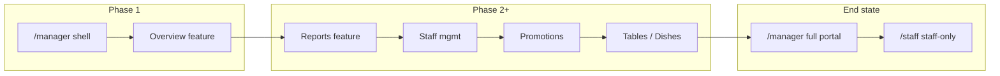

# Manager Dashboard (`/manager`) Specification

## Problem Statement

Hiện tại Manager và Admin dùng chung portal `/staff` với Restaurant Staff / Kitchen Staff. Role được phân biệt bằng `resolveRole()` và flag `managerOnly` trong sidebar, nhưng URL không phản ánh đúng vai trò, khó deep-link workflow quản lý, và `App.jsx` chưa có route `/manager` (dù `NotFound.jsx` đã có copy cho route này).

Cần tách **Manager Dashboard** sang route riêng `/manager`, giữ `/staff` cho nhân viên vận hành, và áp dụng **Strangler Fig Pattern** để di cư từng feature — không xóa code cũ cho đến khi feature mới được xác nhận hoạt động 100%.

## Goals

- [ ] Manager và Admin truy cập dashboard quản lý tại `/manager` với shell đầy đủ (sidebar, header, routing nội bộ).
- [ ] Phase 1: **Overview** có UI hoàn chỉnh; các mục nav manager khác hiển thị placeholder **Coming soon**.
- [ ] Restaurant Staff và Kitchen Staff chỉ dùng `/staff`; Customer không vào được `/staff` hoặc `/manager`.
- [ ] Di cư code theo Strangler Fig: feature mới nằm trong `src/features/manager-dashboard/`, tách shared primitives khi cần, không xóa `components/staff/` cho đến khi được xác nhận.

## Decisions (Locked)

| Topic | Decision |
| ----- | ---------- |
| Route `/staff` | Chỉ Restaurant Staff + Kitchen Staff |
| Route `/manager` | Manager + Admin |
| Customer | Không được vào `/staff` hoặc `/manager` |
| State | Local state / hooks; **không** dùng Zustand |
| Styling | Giữ CSS hiện tại (`staff-dashboard.css`, class `sfx-*`); **không** cài Tailwind |
| Customer portal | Không đụng Navbar, Footer, Auth trừ khi bắt buộc cho routing |
| Phase 1 scope | Shell đầy đủ + Overview; nav khác = Coming soon |
| Migration | Strangler Fig — di cư từng feature, review diff trước khi apply, không xóa code cũ sớm |
| Admin portal | Admin dùng cùng `/manager` (stub `AdminDashboard.jsx` không wire trong phase 1) |

## Out of Scope

| Feature | Reason |
| ------- | ------ |
| React Router migration | Vẫn dùng routing thủ công trong `App.jsx` (ghi nhận trong CONCERNS.md) |
| Zustand / global store | Quyết định dùng local state |
| Tailwind CSS | Quyết định giữ CSS hiện tại |
| Backend `/api/manager/*` mới | Phase 1 reuse `/api/staff/*` qua `managerApi.js` wrapper |
| Wire route `/admin` | Chưa có admin portal riêng |
| Di cư Reports / Staff / Promotions / … | Phase 2+ theo Strangler Fig |
| Server-side role enforcement | Frontend guard only (tech debt đã ghi trong CONCERNS.md) |
| Xóa `components/staff/sections/OverviewSection.jsx` | Chỉ xóa sau khi Overview mới verified và staff portal không còn phụ thuộc |

---

## Current State (Brownfield)

### Routing

- `App.jsx` → `getPageFromPath()` map `/staff` → `"staff"`; **không** có `/manager`.
- `isPortalPage` ẩn Navbar/Footer khi pathname bắt đầu `/staff` — cần mở rộng cho `/manager`.
- `NotFound.jsx` đã có messaging cho `/manager` và phân quyền Staff vs Manager.

### Staff portal (sẽ thu hẹp dần)

| File | Vai trò |
| ---- | ------- |
| `pages/staff/StaffDashboard.jsx` | Entry; `resolveRole()`; fetch toàn bộ data; render sections |
| `components/staff/StaffLayout.jsx` | Shell layout |
| `components/staff/StaffSidebar.jsx` | Nav; lọc `managerOnly` |
| `components/staff/StaffHeader.jsx` | Title, search, quick action |
| `components/staff/sections/OverviewSection.jsx` | Dashboard overview (KPI, chart, timeline, tables, orders, best sellers) |
| `data/staffNav.js` | Nav groups; `managerOnly` flags |
| `services/staffApi.js` | GET `/api/staff/*` + mock fallback |
| `styles/staff-dashboard.css` | Toàn bộ styling portal nội bộ |

### Overview logic cần tách (reference)

`OverviewSection.jsx` hiện gồm:

1. **KpiGrid** — `KpiCard` × N; manager thấy đủ KPI (gồm revenue), staff ẩn `revenue`.
2. **RevenueChartPanel** — `RevenueChart` (chỉ manager).
3. **QuickActionsBar** — 5 nút: Add Dish, Add Table, Create Promotion, Export Report, View Reservations.
4. **FloorSnapshotPanel** — Reservation Timeline (top 5) + Table Status Board (counts + 12 tiles).
5. **BestSellersPanel** — ranked list + revenue.
6. **Active Orders table** — nằm trong overview grid (có thể giữ trong `FloorSnapshotPanel` hoặc panel riêng phase 1 — xem Component Plan).

Manager overview **không** lọc KPI revenue (luôn full manager view).

---

## User Stories

### P1: Manager truy cập portal riêng ⭐ MVP

**User Story**: Là Manager/Admin, tôi muốn mở `/manager` để xem dashboard quản lý tách biệt khỏi staff portal.

**Why P1**: Đây là mục tiêu chính của feature; mọi requirement khác gắn vào route này.

**Acceptance Criteria**:

1. WHEN user đã đăng nhập với `roleName` là `Manager` hoặc `Admin` AND truy cập `/manager` THEN app SHALL render `ManagerDashboard` without Navbar/Footer.
2. WHEN guest truy cập `/manager` THEN app SHALL render restricted NotFound (giống pattern `/staff` hiện tại).
3. WHEN Customer truy cập `/manager` THEN app SHALL render customer-restricted NotFound.
4. WHEN Restaurant Staff hoặc Kitchen Staff truy cập `/manager` THEN app SHALL render permission-required NotFound với CTA về `/staff`.

**Independent Test**: Đăng nhập account Manager → navigate `/manager` → thấy layout manager, không thấy Navbar customer.

**Requirements**: MGR-001, MGR-002, MGR-003, MGR-004, MGR-005

---

### P1: Phân tách quyền `/staff` vs `/manager` ⭐ MVP

**User Story**: Là hệ thống, tôi muốn mỗi role chỉ vào đúng portal để tránh nhầm workspace.

**Why P1**: Quyết định product đã chốt; ảnh hưởng guard và NotFound copy.

**Acceptance Criteria**:

1. WHEN Manager hoặc Admin truy cập `/staff` THEN app SHALL redirect sang `/manager` (replaceState hoặc pushState một lần, không loop).
2. WHEN Restaurant Staff hoặc Kitchen Staff truy cập `/staff` THEN app SHALL render `StaffDashboard` như hiện tại (chỉ nav non-manager).
3. WHEN Customer truy cập `/staff` THEN app SHALL render customer-restricted NotFound.
4. WHEN guest truy cập `/staff` THEN app SHALL render guest-restricted NotFound.

**Independent Test**: Staff account → `/staff` OK; Manager account → `/staff` → landed on `/manager`.

**Requirements**: MGR-010, MGR-011, MGR-012, MGR-013

---

### P1: Shell manager với nav và placeholder ⭐ MVP

**User Story**: Là Manager, tôi muốn sidebar/header thống nhất và biết feature nào sẵn sàng vs sắp có.

**Why P1**: Scope phase 1 = shell + overview; nav phải reflect roadmap manager.

**Acceptance Criteria**:

1. WHEN ManagerDashboard mount THEN shell SHALL hiển thị `ManagerSidebar`, `ManagerHeader`, và vùng content.
2. WHEN user chọn nav item có `implemented: true` THEN content SHALL render panel tương ứng (phase 1: chỉ `overview`).
3. WHEN user chọn nav item chưa implement THEN content SHALL hiển thị Coming soon placeholder (title + mô tả ngắn, không crash).
4. WHEN sidebar render THEN brand text SHALL là **Manager Portal** (phân biệt Staff Portal).
5. WHEN viewport mobile THEN sidebar SHALL dùng cùng pattern mobile scrim/collapse như staff (reuse CSS `sfx-*`).

**Independent Test**: Click từng mục sidebar → Overview có data; Reports → Coming soon.

**Requirements**: MGR-020, MGR-021, MGR-022, MGR-023, MGR-024

---

### P1: Overview dashboard hoạt động ⭐ MVP

**User Story**: Là Manager, tôi muốn xem KPI, doanh thu, sàn nhà hàng, best sellers và quick actions trên overview.

**Why P1**: Đây là vertical slice đầu tiên của Strangler Fig.

**Acceptance Criteria**:

1. WHEN Overview load THEN `useManagerDashboard` SHALL fetch KPI, revenue series, reservations, tables, orders, best sellers (parallel, mock fallback giống staff).
2. WHEN data loading THEN Overview SHALL hiển thị loading state (`sfx-loading` / spinner).
3. WHEN fetch fail THEN toast error SHALL xuất hiện (pattern toast trong StaffDashboard).
4. WHEN Overview render THEN `KpiGrid` SHALL hiển thị **tất cả** KPI cards (không ẩn revenue).
5. WHEN Overview render THEN `RevenueChartPanel` SHALL hiển thị biểu đồ doanh thu.
6. WHEN user click Quick Action THEN app SHALL navigate nội bộ tới view tương ứng; nếu view chưa implement THEN SHALL hiển thị Coming soon.
7. WHEN Overview render THEN `FloorSnapshotPanel` SHALL hiển thị reservation timeline (top 5) và table status snapshot.
8. WHEN Overview render THEN `BestSellersPanel` SHALL hiển thị top best-selling dishes.

**Independent Test**: Manager `/manager` → overview đầy đủ KPI + chart; mock data hiển thị khi API down.

**Requirements**: MGR-030, MGR-031, MGR-032, MGR-033, MGR-034, MGR-035, MGR-036, MGR-037

---

### P2: Strangler Fig — chuẩn bị di cư feature tiếp theo

**User Story**: Là developer, tôi muốn cấu trúc feature rõ ràng để di cư Reports, Staff, Promotions… mà không phá staff portal.

**Why P2**: Không blocking MVP nhưng phải thiết kế sẵn trong spec.

**Acceptance Criteria**:

1. WHEN thêm feature mới THEN code SHALL nằm under `src/features/manager-dashboard/<feature>/`.
2. WHEN UI primitive dùng chung giữa staff và manager THEN SHALL tách vào `src/components/common/` (hoặc giữ import từ `components/staff/StaffUI.jsx` tạm thời — ưu tiên tách khi touch file).
3. WHEN feature mới verified THEN staff portal MAY import module mới thay module cũ (review diff trước).
4. WHEN chưa verified THEN code cũ trong `components/staff/` SHALL remain untouched.

**Independent Test**: Cấu trúc thư mục tồn tại; không file staff bị xóa trong phase 1.

**Requirements**: MGR-060, MGR-061, MGR-062, MGR-063

---

## Component Plan

Phase 1 tạo các file sau. **Không implement trong spec phase** — chỉ định nghĩa trách nhiệm.

```
src/
├── pages/manager/
│   └── ManagerDashboard.jsx          # Route entry: guards, hook, layout, view switch
├── features/manager-dashboard/
│   ├── config/
│   │   └── managerNav.js             # Nav groups; flag `implemented`
│   ├── hooks/
│   │   └── useManagerDashboard.js    # Local state: loading, data, toast, navigate
│   ├── layout/
│   │   ├── ManagerLayout.jsx         # Compose sidebar + header + main + toasts
│   │   ├── ManagerSidebar.jsx        # Render managerNav; mobile/collapse
│   │   └── ManagerHeader.jsx         # Title/subtitle/search/quick action
│   └── overview/
│       ├── OverviewPanel.jsx         # Orchestrator: compose sub-panels
│       ├── KpiGrid.jsx               # Map KPI → KpiCard (reuse staff primitive)
│       ├── RevenueChartPanel.jsx     # Card wrapper + RevenueChart
│       ├── QuickActionsBar.jsx       # Manager quick actions → internal navigate
│       ├── FloorSnapshotPanel.jsx    # Timeline + table board (+ active orders table)
│       └── BestSellersPanel.jsx      # Ranked best sellers list
└── services/
    └── managerApi.js                 # Overview getters; delegate staffApi / same endpoints
```

### Component responsibilities

| Component | Trách nhiệm | Reuse từ staff |
| --------- | ----------- | -------------- |
| `ManagerDashboard.jsx` | Resolve access (`manager`/`admin` only); gọi hook; `switch(view)` overview vs coming soon; pass props layout | Pattern `StaffDashboard.jsx` |
| `ManagerLayout.jsx` | Grid shell, toast stack, children slot | `StaffLayout.jsx` (adapt props) |
| `ManagerSidebar.jsx` | Filter/render `managerNav`; active state | `StaffSidebar.jsx` |
| `ManagerHeader.jsx` | Dynamic title/subtitle; search (local, optional phase 1); sign out | `StaffHeader.jsx` |
| `managerNav.js` | Nav config: `{ id, label, view, icon, action?, implemented }` | Subset `staffNav.js` manager items + overview |
| `useManagerDashboard.js` | `useState` data bundle; `useEffect` fetch; `navigate(view, action)`; toast helper | Logic tách từ `StaffDashboard.jsx` (overview subset) |
| `managerApi.js` | `fetchManagerOverview()` hoặc granular getters wrapping `staffApi` | `staffApi.js` |
| `OverviewPanel.jsx` | Layout grid overview (`sfx-stack`, `sfx-grid`) | `OverviewSection.jsx` structure |
| `KpiGrid.jsx` | Render all KPIs | `KpiCard.jsx` |
| `RevenueChartPanel.jsx` | Manager-only chart card | `RevenueChart.jsx` |
| `QuickActionsBar.jsx` | 5 manager actions | Constants từ `OverviewSection` |
| `FloorSnapshotPanel.jsx` | Reservation timeline + table tiles; **includes** active orders table (giữ parity overview cũ) | JSX từ `OverviewSection` |
| `BestSellersPanel.jsx` | Best sellers rank list | JSX từ `OverviewSection` |

### `managerNav.js` — Phase 1 items (draft)

| id | label | view | implemented (phase 1) |
| -- | ----- | ---- | --------------------- |
| overview | Dashboard | overview | ✅ |
| today | Today Operations | today | ❌ Coming soon |
| reservations | Live Reservations | reservations | ❌ |
| res-report | Reservation Report | reports | ❌ |
| table-map | Table Map | tables | ❌ |
| dish-list | Dish List | dishes | ❌ |
| staff-list | Staff List | staff | ❌ |
| promo-list | Promotions | promotions | ❌ |
| report-revenue | Revenue Dashboard | reports | ❌ |
| settings | Restaurant Settings | settings | ❌ |

Quick actions có thể navigate tới view chưa implement → Coming soon panel (MGR-036).

### Shared primitives (Strangler — tách khi cần)

Phase 1 **có thể** import trực tiếp (không bắt buộc move ngay):

- `@/components/staff/KpiCard.jsx`
- `@/components/staff/RevenueChart.jsx`
- `@/components/staff/StaffUI.jsx` (`Card`, `Button`, `StatusBadge`)
- `@/components/staff/StaffIcons.jsx`
- `@/data/staffDashboardMockData.js` (status meta)

Phase 2+: tách `Card`, `Button`, `StatusBadge` → `components/common/` khi di cư feature thứ 2.

### CSS

- Import `@/styles/staff-dashboard.css` trong `ManagerDashboard.jsx` (hoặc `ManagerLayout.jsx`).
- Không tạo file CSS mới trừ khi cần modifier nhỏ (ưu tiên reuse class `sfx-*`).
- Không cài Tailwind.

### State (`useManagerDashboard.js`)

```text
state:
  activeId, view, pendingAction
  loading, data: { kpis, revenue, reservations, tables, orders, bestSellers }
  toasts[]

actions:
  navigate(view, action?)
  onSelect(navItem)
  toast(message, tone)
```

Không dùng Zustand, Context global, hay prop drilling qua App (chỉ nhận auth props từ App).

### `managerApi.js`

Phase 1:

- Re-export hoặc wrap: `fetchKpis`, `fetchRevenueSeries`, `fetchReservations`, `fetchTables`, `fetchOrders`, `fetchBestSellers` từ `staffApi.js`.
- Optional: `fetchManagerOverview()` gom parallel calls (single entry cho hook).
- Không đổi backend routes trong phase 1.

---

## Edge Cases

| ID | WHEN | THEN system SHALL |
| -- | ---- | ----------------- |
| MGR-E01 | Manager bookmark `/staff` | Redirect once to `/manager` |
| MGR-E02 | Direct URL `/manager` on hard refresh | Parse pathname in `App.jsx` init + popstate |
| MGR-E03 | `roleName` casing khác (`manager` vs `Manager`) | Normalize lowercase trong guard (giống `resolveRole`) |
| MGR-E04 | API unreachable | Show mock data + optional toast (staffApi behavior) |
| MGR-E05 | Empty reservations/tables/orders arrays | Render empty states trong panel (không throw) |
| MGR-E06 | User sign out từ manager portal | `onSignOut` from App → navigate home |
| MGR-E07 | NotFound CTA "Go to Manager Dashboard" | Target page key `manager` → `/manager` (update NotFound paths) |

---

## Requirement Traceability

| Requirement ID | Story | Description | Phase | Status |
| -------------- | ----- | ----------- | ----- | ------ |
| MGR-001 | P1 | Register `/manager` in `getPageFromPath()` → `"manager"` | Execute | Pending |
| MGR-002 | P1 | Render `ManagerDashboard` when `activePage === "manager"` | Execute | Pending |
| MGR-003 | P1 | Extend `isPortalPage` to include `/manager` (hide Navbar/Footer) | Execute | Pending |
| MGR-004 | P1 | Manager/Admin allowed on `/manager` | Execute | Pending |
| MGR-005 | P1 | Guest/Customer/Staff denied on `/manager` with NotFound | Execute | Pending |
| MGR-010 | P1 | Staff roles allowed on `/staff` only | Execute | Pending |
| MGR-011 | P1 | Manager/Admin redirected from `/staff` to `/manager` | Execute | Pending |
| MGR-012 | P1 | Customer denied on `/staff` | Execute | Pending |
| MGR-013 | P1 | Guest denied on `/staff` | Execute | Pending |
| MGR-020 | P1 | `ManagerLayout` shell with sidebar/header/main | Execute | Pending |
| MGR-021 | P1 | `managerNav.js` drives sidebar items | Execute | Pending |
| MGR-022 | P1 | Unimplemented nav → Coming soon view | Execute | Pending |
| MGR-023 | P1 | Sidebar brand: Manager Portal | Execute | Pending |
| MGR-024 | P1 | Mobile sidebar behavior parity with staff | Execute | Pending |
| MGR-030 | P1 | `useManagerDashboard` fetches overview data set | Execute | Pending |
| MGR-031 | P1 | Loading state while fetching | Execute | Pending |
| MGR-032 | P1 | Error toast on fetch failure | Execute | Pending |
| MGR-033 | P1 | `KpiGrid` shows all KPIs including revenue | Execute | Pending |
| MGR-034 | P1 | `RevenueChartPanel` renders revenue chart | Execute | Pending |
| MGR-035 | P1 | `FloorSnapshotPanel` timeline + tables (+ orders table) | Execute | Pending |
| MGR-036 | P1 | `QuickActionsBar` navigates or shows Coming soon | Execute | Pending |
| MGR-037 | P1 | `BestSellersPanel` renders ranked dishes | Execute | Pending |
| MGR-040 | P1 | Import `staff-dashboard.css`; no Tailwind | Execute | Pending |
| MGR-041 | P1 | Local state only; no Zustand | Execute | Pending |
| MGR-060 | P2 | New features under `features/manager-dashboard/` | Design | Pending |
| MGR-061 | P2 | Shared primitives extraction policy documented | Design | Pending |
| MGR-062 | P2 | No deletion of staff code until user confirms | Execute | Pending |
| MGR-063 | P2 | Present plan + diff review before file moves | Process | Pending |

**Coverage**: 25 requirements — 25 mapped to tasks (see `tasks.md`)

---

## App.jsx Changes (Minimal — for Execute phase)

Chỉ liệt kê để trace; **không implement trong Specify**.

1. `getPageFromPath`: thêm branch `/manager`.
2. `isPortalPage`: `pathname.startsWith("/manager")`.
3. Import + render `ManagerDashboard` với cùng auth props như `StaffDashboard`.
4. `StaffDashboard`: từ chối role `manager`/`admin` → redirect `/manager` (hoặc guard ở App trước render).
5. `NotFound.jsx`: thêm `manager: "/manager"` trong paths; sửa CTA "Go to Manager Dashboard" từ `staff` → `manager`.

**Không** sửa Navbar, Footer, AuthModal trừ path navigate nội bộ.

---

## Strangler Fig Roadmap (Post Phase 1)



Mỗi bước: analyze → build in `features/manager-dashboard/` → integrate → user confirms → optionally replace staff section → **never delete** old code until confirmed.

**Note**: `CODE_MAP.md` chưa tồn tại trong repo; dùng `.specs/codebase/STRUCTURE.md` + file cũ của feature làm nguồn phân tích thay thế.

---

## Success Criteria

- [ ] Manager mở `/manager` thấy overview đầy đủ (KPI + revenue chart + floor snapshot + best sellers + quick actions).
- [ ] Staff mở `/staff` không thấy nav manager-only; Manager bị redirect khỏi `/staff`.
- [ ] Customer/guest không vào được cả hai portal.
- [ ] Sidebar manager hiển thị Coming soon cho feature chưa migrate.
- [ ] Không file nào trong `components/staff/` bị xóa trong phase 1.
- [ ] Không dependency Tailwind / Zustand mới.

---

## Open Questions (Resolved)

| Question | Resolution |
| -------- | ---------- |
| Phase 1 scope? | Shell + Overview; rest Coming soon |
| Manager on `/staff`? | Redirect to `/manager` (end-state role separation; staff portal code remains for staff roles) |
| Reuse strategy? | Strangler Fig; build under `features/manager-dashboard/`; reuse staff CSS + primitives; extract common later |
| Tailwind in strangler template? | **Rejected** — locked decision keeps existing CSS |

---

## Next Steps (after spec approval)

1. **Design** (optional): `design.md` — diagram view switch + hook data flow nếu team cần.
2. **Tasks**: `tasks.md` — atomic tasks per MGR-* với verification gates.
3. **Execute**: Implement theo MGR-001…MGR-037; present diff for review before any staff file deletion.
